# K-Wise Database Architecture Report

**Generated:** 2026-03-28  
**Database:** KWiseDB (PostgreSQL 17.2)  
**Size:** 320 MB (post-optimization, down from ~360 MB)  
**Author:** Database Architecture Review — Phases 1–4

---

## Table of Contents

1. [Executive Summary](#1-executive-summary)
2. [Current State Assessment](#2-current-state-assessment)
3. [Domain Boundary Analysis](#3-domain-boundary-analysis)
4. [Entity Relationship Diagrams](#4-entity-relationship-diagrams)
5. [Table-Per-Type Inheritance Model](#5-table-per-type-inheritance-model)
6. [What Was Fixed (Phases 1–3)](#6-what-was-fixed-phases-13)
7. [Orphan Table Analysis](#7-orphan-table-analysis)
8. [Performance Profile](#8-performance-profile)
9. [Architecture Recommendations](#9-architecture-recommendations)
10. [Migration Roadmap](#10-migration-roadmap)

---

## 1. Executive Summary

| Metric | Before | After | Change |
|--------|--------|-------|--------|
| Database Size | ~360 MB | 320 MB | -40 MB (11%) |
| Tables | 130 | 131 (+_migration_history) | +1 |
| Indexes | ~673 | 576 | -97 dropped |
| Triggers | 53 | 48 | -5 duplicates removed |
| FK Constraints | ~102 | 112+ | +10 new |
| Orphan Tables (no FK) | 68 | 59 | -9 now linked |
| Soft-Delete Coverage | 0/10 component tables | 10/10 | +10 is_active columns |
| Dead Tables | 3 active | 3 renamed _deprecated_ | 3 preserved safely |
| Security Issues | 1 hardcoded password | 0 | Fixed |

### Key Outcomes
- **Zero data deleted** across all migrations — all removals use soft-delete or renamed-as-deprecated patterns
- 10 component tables now have FK constraints to `pc_parts` (ON UPDATE CASCADE)
- 97 duplicate/unused indexes dropped, recovering ~40 MB disk and reducing write amplification
- Migration history tracked in `_migration_history` table with execution timestamps

---

## 2. Current State Assessment

### Database Inventory

| Object Type | Count |
|-------------|-------|
| Tables | 131 |
| Views | 18 |
| Indexes | 576 |
| Triggers | 48 |
| Functions | 74 |
| Sequences | 130 |
| Extensions | pg_trgm 1.6, plpgsql 1.0 |

### Top 10 Tables by Size

| Table | Total Size | Data Size | Est. Rows | Domain |
|-------|-----------|-----------|-----------|--------|
| ai_audit_logs | 134 MB | 24 MB | 44,055 | AI/ML |
| ip_logs | 95 MB | 89 MB | 273,791 | Security |
| compatibility_logs | 54 MB | 45 MB | 34,343 | Compatibility Engine |
| compatibility_rules | 3.7 MB | 2.3 MB | 3,200 | Compatibility Engine |
| pc_parts | 2.7 MB | 760 KB | 427 | Product Catalog |
| rule_version_history | 1.6 MB | 1.2 MB | 3,200 | Compatibility Engine |
| ai_logs | 1.4 MB | 208 KB | 394 | AI/ML |
| pc_upgrade_reference_builds | 1.2 MB | 48 KB | 72 | PC Builder |
| product_specs | 840 KB | 240 KB | 392 | Product Catalog |
| notifications | 824 KB | 664 KB | 858 | Notifications |

### Size Distribution

- **88% of DB size** is in 3 tables: `ai_audit_logs` (42%), `ip_logs` (30%), `compatibility_logs` (17%)
- Remaining 128 tables occupy only ~37 MB combined (~12%)
- These 3 tables are prime candidates for partitioning (see Section 9)

---

## 3. Domain Boundary Analysis

The database organizes into **8 distinct domains**:

### Domain Map

```
┌──────────────────────────────────────────────────────────────────────┐
│                         K-Wise Database                             │
├──────────────┬───────────────┬──────────────┬───────────────────────┤
│  PRODUCT     │  ORDERS &     │ COMPATIBILITY│  AI / MACHINE        │
│  CATALOG     │  TRANSACTIONS │ ENGINE       │  LEARNING            │
│              │               │              │                       │
│  pc_parts    │  orders       │ compat_rules │  ai_audit_logs       │
│  cpu         │  order_items  │ compat_logs  │  ai_logs             │
│  gpu         │  transactions │ compat_cache │  ai_recommendations  │
│  motherboard │  pending_*    │ rule_version │  ai_corrections      │
│  ram         │  queue_mgmt   │ rule_ab_*    │  ai_feedback         │
│  storage     │  order_queue  │ *_compat (7) │  ai_metrics          │
│  psu         │  order_locks  │ known_issues │  ai_training_data    │
│  pc_case     │  order_dedup  │              │  ai_pending_reviews  │
│  cooling     │               │              │  ai_cache            │
│  monitor     │               │              │                       │
│  webcam      │               │              │                       │
│  categories  │               │              │                       │
│  product_*   │               │              │                       │
│  price_*     │               │              │                       │
├──────────────┼───────────────┼──────────────┼───────────────────────┤
│  USER &      │  PC BUILDER   │ KIOSK &      │  SYSTEM /            │
│  AUTH        │  & BUILDS     │ QUEUE        │  INFRASTRUCTURE      │
│              │               │              │                       │
│  users       │  prebuilt_pcs │ kiosk_sess   │  settings            │
│  user_sess   │  prebuilt_*   │ assistance_* │  system_settings     │
│  password_*  │  successful_* │ queue_mgmt   │  ip_logs             │
│  api_keys    │  historical_* │ queue_cycles │  ip_access_control   │
│  activity_*  │  build_*      │ speakers     │  rate_limits         │
│  audit_logs  │  pc_upgrade_* │ headphones   │  deployment_config   │
│  messages    │  pc_custom_*  │ mouse        │  system_monitoring   │
│  notif_*     │  reference_*  │ keyboard     │  _migration_history  │
│  user_prefs  │               │              │  _deprecated_*       │
│  user_pers   │               │              │                       │
│  feedback_*  │               │              │                       │
└──────────────┴───────────────┴──────────────┴───────────────────────┘
```

### Domain Statistics

| Domain | Tables | Largest Table | Total Est. Size |
|--------|--------|---------------|-----------------|
| AI/ML | 12 | ai_audit_logs (134 MB) | ~136 MB |
| System/Infrastructure | 10 | ip_logs (95 MB) | ~96 MB |
| Compatibility Engine | 14 | compatibility_logs (54 MB) | ~59 MB |
| Product Catalog | 16 | pc_parts (2.7 MB) | ~6 MB |
| PC Builder & Builds | 18 | pc_upgrade_reference_builds (1.2 MB) | ~3 MB |
| Orders & Transactions | 10 | orders (480 KB) | ~1.5 MB |
| User & Auth | 16 | notifications (824 KB) | ~2 MB |
| Kiosk & Queue | 8 | assistance_requests (712 KB) | ~1 MB |

---

## 4. Entity Relationship Diagrams

### Core Domain ERD (Mermaid)

```mermaid
erDiagram
    %% ─── PRODUCT CATALOG (Table-Per-Type Inheritance) ───
    categories ||--o{ pc_parts : "has"
    users ||--o{ pc_parts : "updated_by"
    
    pc_parts ||--o| cpu : "id = id"
    pc_parts ||--o| gpu : "id = id"
    pc_parts ||--o| motherboard : "id = id"
    pc_parts ||--o| ram : "id = id"
    pc_parts ||--o| storage : "id = id"
    pc_parts ||--o| psu : "id = id"
    pc_parts ||--o| pc_case : "id = id"
    pc_parts ||--o| cooling : "id = id"
    pc_parts ||--o| monitor : "id = id"
    pc_parts ||--o| webcam : "id = id"
    
    pc_parts ||--o{ product_specs : "product_id"
    pc_parts ||--o{ price_history : "product_id"
    pc_parts ||--o{ price_alerts : "product_id"
    pc_parts ||--o{ component_performance_tiers : "component_id"
    pc_parts ||--o{ feedback_submissions : "component_id"
    
    %% ─── ORDERS & TRANSACTIONS ───
    users ||--o{ orders : "created_by"
    orders ||--o{ order_items : "order_id"
    order_items }o--|| stock_items : "stock_item_id"
    stock_items }o--|| stock_categories : "category_id"
    orders ||--o{ transactions : "order_id"
    orders ||--o{ queue_management : "order_id"
    orders ||--o{ order_queue : "order_id"
    orders ||--o| order_locks : "order_id"
    orders }o--o| user_virtual_build : "virtual_build_id"
    
    %% ─── USERS & AUTH ───
    users ||--o{ user_sessions : "user_id"
    users ||--o{ password_resets : "user_id"
    users ||--o{ password_history : "user_id"
    users ||--o{ api_keys : "user_id"
    users ||--o{ audit_logs : "user_id"
    users ||--o{ notifications : "user_id"
    users ||--o{ messages : "from/to"
    users ||--o{ activity_log : "user_id"
    
    %% ─── COMPATIBILITY ENGINE ───
    users ||--o{ compatibility_rules : "created_by"
    compatibility_rules ||--o{ rule_version_history : "rule_id"
    compatibility_rules ||--o{ rule_effectiveness_metrics : "rule_id"
    compatibility_rules ||--o{ rule_ab_tests : "control/variant"
    rule_ab_tests ||--o{ rule_ab_test_results : "experiment_id"
    users ||--o{ compatibility_logs : "user_id"
    
    %% ─── AI/ML ───
    users ||--o{ ai_audit_logs : "user_id"
    users ||--o{ ai_logs : "user_id"
    ai_recommendations ||--o{ ai_audit_logs : "recommendation_id"
    ai_recommendations ||--o{ ai_feedback : "recommendation_id"
    
    %% ─── PC BUILDER ───
    pc_parts ||--o{ build_patterns : "cpu_id, gpu_id, etc."
    pc_parts ||--o{ successful_builds : "cpu_id, gpu_id, etc."
    pc_parts ||--o{ historical_builds : "cpu_id, gpu_id"
    pc_parts ||--o{ pc_customized_ai_reference_builds : "cpu_id, etc."
    prebuilt_pcs ||--o{ prebuilt_components : "prebuilt_pc_id"
    prebuilt_components }o--|| pc_parts : "pc_part_id"
    
    %% ─── SECURITY ───
    users ||--o{ ip_logs : "user_id"
    ip_access_control ||--o{ ip_logs : "ip_control_id"
    users ||--o{ ip_access_control : "blocked_by"
```



### Simplified Hub Diagram

```
                              ┌─────────┐
                    ┌─────────│  users   │──────────┐
                    │         └────┬────┘           │
                    │              │                  │
               ┌────▼────┐   ┌────▼────┐      ┌─────▼──────┐
               │ orders   │   │audit_log│      │ ip_logs    │
               └────┬────┘   └─────────┘      └────────────┘
                    │
            ┌───────┼──────────┐
       ┌────▼───┐ ┌─▼──────┐ ┌▼──────────┐
       │order_  │ │transac- │ │queue_mgmt │
       │items   │ │tions    │ │           │
       └────────┘ └─────────┘ └───────────┘

                    ┌──────────┐
          ┌─────────│ pc_parts │──────────┐
          │         └────┬────┘           │
     ┌────▼──┐    ┌──────┼──────┐    ┌────▼─────┐
     │  cpu  │    │  gpu │ ram  │    │motherboard│
     └───────┘    └──────┴──────┘    └──────────┘
     ┌───────┐    ┌──────┐┌─────┐   ┌──────────┐
     │storage│    │ psu  ││case │   │ cooling   │
     └───────┘    └──────┘└─────┘   └──────────┘
     ┌───────┐    ┌──────┐
     │monitor│    │webcam│
     └───────┘    └──────┘
```

### Hub Centrality

The two central hub tables in the schema are:

| Hub | Inbound FK Count | Outbound FK Count | Total Connections |
|-----|-----------------|-------------------|-------------------|
| `users` | 35+ | 0 | 35+ tables reference it |
| `pc_parts` | 25+ | 2 (categories, users) | 27+ tables reference it |

---

## 5. Table-Per-Type Inheritance Model

### Pattern Description

K-Wise uses a **Table-Per-Type (TPT)** inheritance pattern for PC components:

```
pc_parts (parent)
├── id, name, brand, model, category, price, stock, tier_classification, ...
│
├── cpu (child)      → socket, cores, threads, base_clock, boost_clock, tdp, ...
├── gpu (child)      → chipset, vram, clock_speed, memory_type, ...
├── motherboard      → socket, chipset, form_factor, ram_slots, max_ram, ...
├── ram              → type, speed, capacity, modules, cas_latency, ...
├── storage          → type, capacity, interface, read_speed, write_speed, ...
├── psu              → wattage, efficiency_rating, modular, ...
├── pc_case          → form_factor, max_gpu_length, max_cooler_height, ...
├── cooling          → type, fan_size, tdp_rating, noise_level, ...
├── monitor          → resolution, refresh_rate, panel_type, size, ...
└── webcam           → resolution, fps, fov, microphone, ...
```

### Join Pattern (used throughout codebase)

```sql
SELECT p.*, c.socket, c.cores, c.threads, c.base_clock, c.boost_clock
FROM pc_parts p
LEFT JOIN cpu c ON p.id = c.id AND p.category = 'CPU'
WHERE p.category = 'CPU' AND p.is_active = true;
```

### Coverage

| Component Table | Rows | FK to pc_parts | is_active | Notes |
|----------------|------|----------------|-----------|-------|
| cpu | 34 | ✅ fk_cpu_pc_parts | ✅ | All IDs aligned |
| gpu | 40 | ✅ fk_gpu_pc_parts | ✅ | All IDs aligned |
| motherboard | 43 | ✅ fk_motherboard_pc_parts | ✅ | All IDs aligned |
| ram | 28 | ✅ fk_ram_pc_parts | ✅ | All IDs aligned |
| storage | 26 | ✅ fk_storage_pc_parts | ✅ | All IDs aligned |
| psu | 23 | ✅ fk_psu_pc_parts | ✅ | All IDs aligned |
| pc_case | 26 | ✅ fk_pc_case_pc_parts | ✅ | All IDs aligned |
| cooling | 31 | ✅ fk_cooling_pc_parts | ✅ | Orphan id=726 fixed |
| monitor | 22 | ✅ fk_monitor_pc_parts | ✅ | All IDs aligned |
| webcam | 5 | ✅ fk_webcam_pc_parts | ✅ | All IDs aligned |

### Key Code References

Component tables are used in these critical files:
- `services/builder.js` — PC build recommendation engine
- `services/enhanced-kiosk.js` — Kiosk product display
- `controllers/stockController.js` — Stock management
- `services/datasetGenerator.js` — AI training data
- `services/productClassificationService.js` — Tier classification

---

## 6. What Was Fixed (Phases 1–3)

### Phase 1: Critical Fixes (001_fix_critical_issues.sql)

| Issue | Severity | Fix |
|-------|----------|-----|
| 5 duplicate BEFORE UPDATE triggers | HIGH | Dropped duplicates on orders, users, settings, transactions, compat_rules |
| Shared sequence conflict (`user` table used `users_id_seq`) | MEDIUM | Created dedicated `user_legacy_id_seq` |
| `audit_logs.created_at` allowed NULL | MEDIUM | Added NOT NULL constraint with default |
| Hardcoded DB password in `config/db.js` | CRITICAL | Removed fallback, env-var only |
| No migration tracking | LOW | Created `_migration_history` table |

### Phase 2: Schema Consolidation (002_schema_consolidation.sql)

| Change | Count | Details |
|--------|-------|---------|
| FK constraints added | 10 | All component tables → pc_parts (ON UPDATE CASCADE) |
| `is_active` columns added | 10 | Boolean NOT NULL DEFAULT true on all component tables |
| Dead tables deprecated | 3 | monitors → _deprecated_monitors, webcams → _deprecated_webcams, user → _deprecated_user |
| Backward-compat views | 3 | Views named `monitors`, `webcams`, `"user"` pointing to deprecated tables |
| Table documentation | 16+ | COMMENT ON TABLE for all component, settings, and deprecated tables |
| Orphan data fixed | 1 | cooling id=726 inserted into pc_parts as parent row |

### Phase 3: Performance Optimization (003_performance_index_cleanup.sql)

| Category | Dropped | Space Recovered |
|----------|---------|-----------------|
| Duplicate indexes | ~55 | ~15 MB |
| Unused indexes (ip_logs) | 6 | ~24 MB |
| Unused indexes (compatibility_logs) | 4 | ~5 MB |
| Unused indexes (ai_audit_logs) | 4 | ~3 MB |
| Unused indexes (other tables) | 28 | ~5 MB |
| **Total** | **~97** | **~40+ MB** |

### Write Amplification Improvement

Each dropped index eliminates one B-tree update per INSERT/UPDATE on that table. For high-volume tables:
- `ip_logs` (273K rows): 6 fewer B-tree writes per INSERT
- `ai_audit_logs` (44K rows): 4 fewer B-tree writes per INSERT
- `compatibility_logs` (34K rows): 4 fewer B-tree writes per INSERT

---

## 7. Orphan Table Analysis

**59 tables** have zero FK relationships (neither reference other tables nor are referenced by other tables).

### Orphan Classification

#### Tier 1: Likely Active — Need FK Constraints Added

These appear to be used by application code but lack proper FK relationships:

| Table | Rows | Size | Probable FK Target |
|-------|------|------|--------------------|
| pc_upgrade_reference_builds | 72 | 1.2 MB | pc_parts (component columns) |
| product_comparisons | 458 | 248 KB | pc_parts (product_id) |
| specification_schemas | 108 | 120 KB | categories (category) |
| motherboard_compatibility | 45 | 120 KB | pc_parts (motherboard_id) |
| ram_compatibility | 17 | 112 KB | pc_parts (component IDs) |
| gpu_compatibility | 27 | 96 KB | pc_parts (component IDs) |
| cpu_compatibility | 24 | 96 KB | pc_parts (component IDs) |
| case_compatibility | 24 | 80 KB | pc_parts (component IDs) |
| psu_compatibility | 38 | 56 KB | pc_parts (component IDs) |
| settings | 19 | 48 KB | N/A (global key-value) |
| system_settings | 43 | 48 KB | N/A (global key-value) |

#### Tier 2: Low/Zero Rows — Likely Unused

These tables appear unused or experimental. They should be reviewed and either deprecated or populated:

| Table | Rows | Size | Notes |
|-------|------|------|-------|
| compatibility_matrix | 0 | 48 KB | Empty — possibly replaced by compatibility_rules |
| ai_cache | 0 | 40 KB | Empty — Redis likely replaced this |
| performancestats | 0 | 8 KB | Empty — never populated |
| queue | 0 | 8 KB | Empty — likely replaced by queue_management |
| payment | 0 | 8 KB | Empty — never implemented |
| services | 0 | 32 KB | Empty — never populated |
| package | 0 | 24 KB | Empty — never populated |
| pc_customized_ai_builds | -1 | 96 KB | Schema-only, unverified |
| pc_services | -1 | 88 KB | Schema-only, unverified |
| user_preferences | -1 | 88 KB | Schema-only, unverified |
| diagnostic_issues | -1 | 80 KB | Schema-only, unverified |
| cooling_compatibility | -1 | 80 KB | Schema-only, unverified |
| kiosk_sessions | -1 | 64 KB | Schema-only, unverified |

#### Tier 3: Utility/Lookup Tables (Correct as-is)

| Table | Rows | Notes |
|-------|------|-------|
| order_counters | 5 | Counter sequences — intentionally standalone |
| _migration_history | 3 | Migration tracking — standalone by design |
| rate_limits | varies | Rate limit tracking — standalone by design |
| deployment_config | varies | Deployment metadata — standalone |

---

## 8. Performance Profile

### Current Trigger Map (48 triggers on 35 tables)

| Trigger Type | Count | Purpose |
|-------------|-------|---------|
| BEFORE UPDATE → update_updated_at | 28 | Auto-update `updated_at` timestamps |
| AFTER INSERT/UPDATE → business logic | 6 | Queue status, feedback stats, user activity |
| BEFORE UPDATE → versioning | 1 | Rule version tracking |
| AFTER UPDATE → price logging | 1 | Price change history on pc_parts |
| BEFORE INSERT/UPDATE → validation | 2 | User preferences validation |
| AFTER UPDATE → security | 1 | Auto-block suspicious IPs |
| BEFORE UPDATE → various timestamps | 9 | Other timestamp functions |

### Trigger Concern: Function Sprawl

5 different functions all do the same thing (update a timestamp column):
- `update_updated_at_column()`
- `update_timestamp()`
- `update_price_history_timestamp()`
- `update_messages_updated_at()`
- `update_assistance_requests_updated_at()`
- `update_pc_customized_builds_timestamp()`
- `update_ip_access_control_timestamp()`

**Recommendation:** Consolidate to a single `set_updated_at()` function. This is a future cleanup to reduce function count from 74 to ~68.

### Connection Pool Configuration

From `config/db.js`:
- Production: 100 max connections
- Load Test: 200 max connections
- Idle timeout: 30s
- Connection timeout: 5s

This is reasonable for the current scale. PostgreSQL default `max_connections` is 100, so ensure `postgresql.conf` is set ≥ 200 if load testing.

---

## 9. Architecture Recommendations

### R1: Partition High-Volume Tables (HIGH PRIORITY)

The top 3 tables consume 88% of database storage and will only grow:

| Table | Rows | Size | Growth Pattern | Partition Strategy |
|-------|------|------|----------------|-------------------|
| ai_audit_logs | 44K | 134 MB | Append-only | RANGE by `created_at` (monthly) |
| ip_logs | 274K | 95 MB | Append-only | RANGE by `created_at` (monthly) |
| compatibility_logs | 34K | 54 MB | Append-only | RANGE by `created_at` (monthly) |

**Benefits:**
- Queries filtering by date range scan only relevant partitions
- Old partitions can be archived/detached without DELETE operations
- VACUUM operates on smaller partitions (faster, less lock contention)
- Estimated query speedup: 5-10x for date-filtered queries

**Implementation approach:**
1. Create new partitioned table with identical schema
2. Migrate data from old table into partitioned table
3. Rename old table → `_pre_partition_*`, new table → original name
4. Update FK constraints and indexes on new partitioned table

### R2: Archive / Retention Policy (HIGH PRIORITY)

Without partitioning, implement a soft-archive strategy:

```
ip_logs older than 90 days     → mark is_archived = true, move to ip_logs_archive
ai_audit_logs older than 90 days → mark is_archived = true, move to ai_audit_logs_archive
compatibility_logs older than 180 days → archive
```

This keeps the hot tables lean and queries fast.

### R3: Deprecate Orphan Tables (MEDIUM PRIORITY)

59 orphan tables is excessive. Recommended approach:

1. **Phase A:** Add FK constraints to Tier 1 tables (11 tables from Section 7)
2. **Phase B:** Rename Tier 2 zero-row tables as `_deprecated_*` (13 tables)
3. **Phase C:** Create backward-compat views for any renamed tables still referenced in code
4. Target: Reduce orphan count from 59 → ~35

### R4: Consolidate Timestamp Trigger Functions (LOW PRIORITY)

Replace 7 identical timestamp functions with a single `set_updated_at()`:

```sql
CREATE OR REPLACE FUNCTION set_updated_at() RETURNS trigger AS $$
BEGIN
  NEW.updated_at = NOW();
  RETURN NEW;
END;
$$ LANGUAGE plpgsql;
```

Then update all 28 triggers to call this single function. This reduces maintenance surface and function count.

### R5: Add Missing Indexes for Common Queries (MEDIUM PRIORITY)

Based on code analysis, these columns are frequently queried but lack dedicated indexes:

| Table | Column(s) | Query Pattern | Index Type |
|-------|-----------|---------------|------------|
| pc_parts | (category, is_active) | Filter by category where active | btree composite |
| pc_parts | (tier_classification) | Filter by tier | btree |
| orders | (created_at) | Date range queries | btree |
| orders | (created_by, status) | User's orders by status | btree composite |
| compatibility_logs | (created_at) | Date range queries | btree |

### R6: Schema Naming Consistency (LOW PRIORITY)

Current inconsistencies:
- `pc_case` vs `pc_parts` (underscore placement)
- `monitor` (singular) vs `notifications` (plural)
- `_deprecated_monitors` vs `monitor` (old plural vs new singular)
- Prefix inconsistency: `idx_`, `trigger_`, `update_` naming varies

Future migrations should enforce a naming convention:
- Tables: singular nouns (`order`, `user`, `product`)
- Indexes: `ix_{table}_{columns}`
- Triggers: `tr_{table}_{event}_{purpose}`
- FK constraints: `fk_{table}_{target_table}`

### R7: Connection Pool Tuning (LOW PRIORITY)

Current config is adequate for development. For production:
- Set `statement_timeout = '30s'` to prevent runaway queries
- Enable `idle_in_transaction_session_timeout = '60s'`
- Consider PgBouncer for connection pooling if concurrent users exceed 50
- Monitor with `pg_stat_activity` dashboard

---

## 10. Migration Roadmap

### Completed ✅

| Phase | Migration | Status | Impact |
|-------|-----------|--------|--------|
| 1 | 001_fix_critical_issues.sql | ✅ Executed | Fixed triggers, sequences, security |
| 2 | 002_schema_consolidation.sql | ✅ Executed | Added FKs, soft-delete, deprecated dead tables |
| 3 | 003_performance_index_cleanup.sql | ✅ Executed | Dropped 97 indexes, recovered 40 MB |

### Recommended Next Phases

| Phase | Priority | Migration | Estimated Impact |
|-------|----------|-----------|-----------------|
| 5 | HIGH | 004_partition_high_volume_tables.sql | 5-10x query speed on log tables |
| 6 | HIGH | 005_archive_retention_policy.sql | Prevent unbounded growth |
| 7 | MEDIUM | 006_orphan_table_fk_constraints.sql | +11 FK constraints, reduce orphans |
| 8 | MEDIUM | 007_deprecate_empty_orphans.sql | -13 empty tables → _deprecated_ |
| 9 | MEDIUM | 008_add_strategic_indexes.sql | Faster common queries |
| 10 | LOW | 009_consolidate_trigger_functions.sql | Reduce function count by ~6 |
| 11 | LOW | 010_naming_convention_cleanup.sql | Consistent naming |

---

## Appendix A: Migration History

```sql
SELECT * FROM _migration_history ORDER BY executed_at;
```

| # | Migration | Executed | Status |
|---|-----------|----------|--------|
| 1 | 001_fix_critical_issues | 2026-03-28 17:01:50 | completed |
| 2 | 002_schema_consolidation | 2026-03-28 17:11:39 | completed |
| 3 | 003_performance_index_cleanup | 2026-03-28 17:14:05 | completed |

## Appendix B: FK Relationship Count by Table

| Table | Inbound FKs | Outbound FKs |
|-------|-------------|-------------|
| users | 35 | 0 |
| pc_parts | 25 | 2 |
| orders | 6 | 4 |
| compatibility_rules | 5 | 3 |
| feedback_submissions | 2 | 3 |
| user_sessions | 1 | 1 |
| ip_access_control | 1 | 1 |
| prebuilt_pcs | 1 | 0 |
| stock_categories | 1 | 0 |
| categories | 1 | 0 |
| ai_recommendations | 2 | 0 |
| compatibility_logs | 1 | 1 |

---

*Report generated by automated database architecture analysis. All migrations preserved full data integrity — zero rows deleted.*
